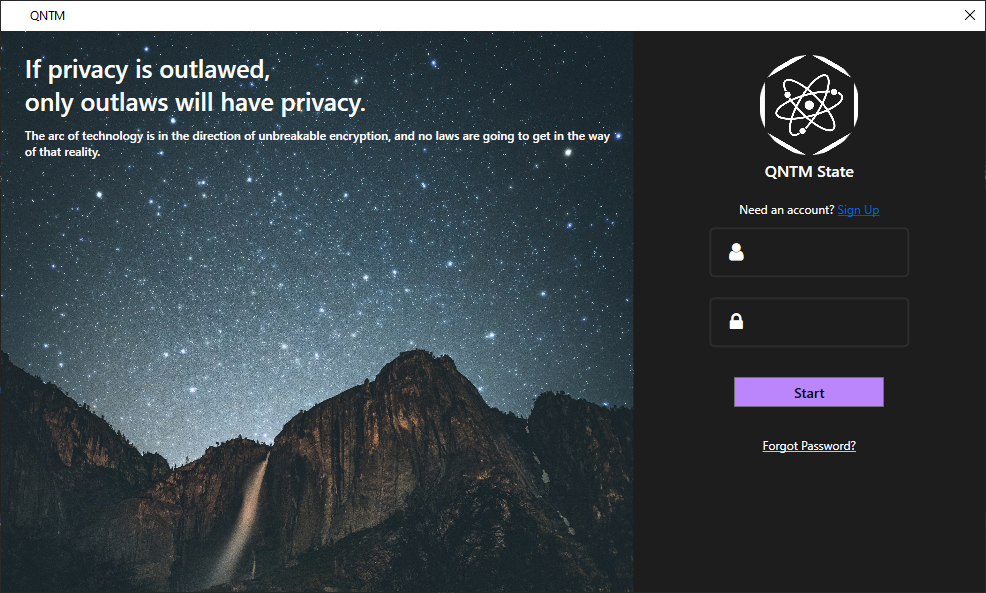
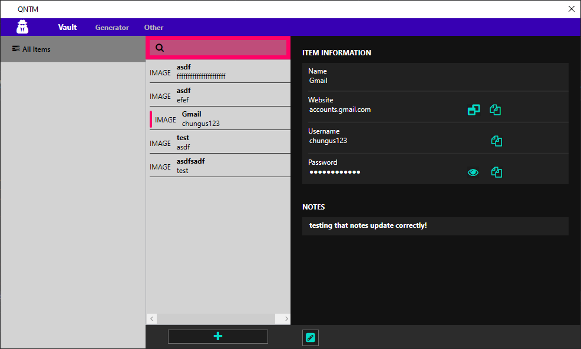
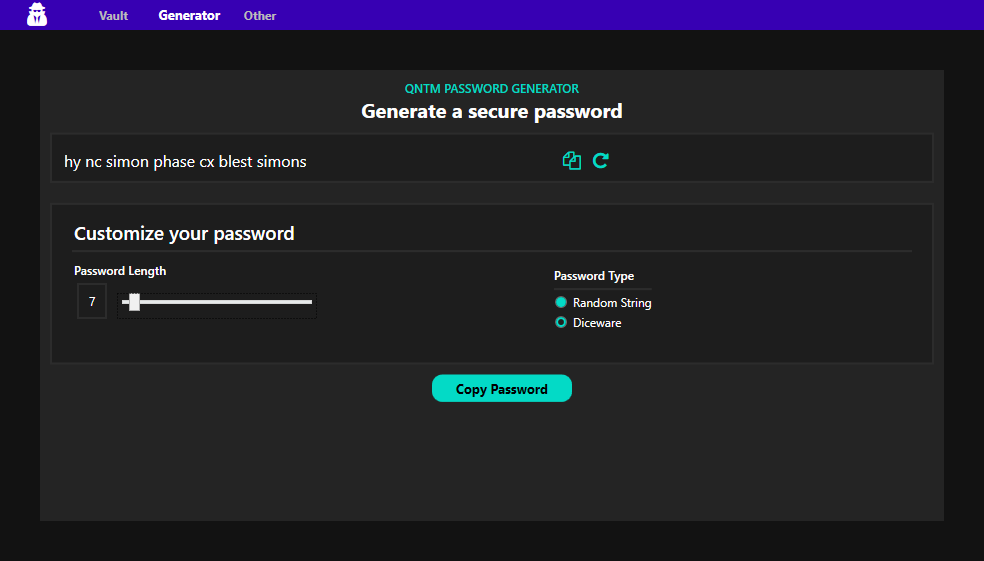
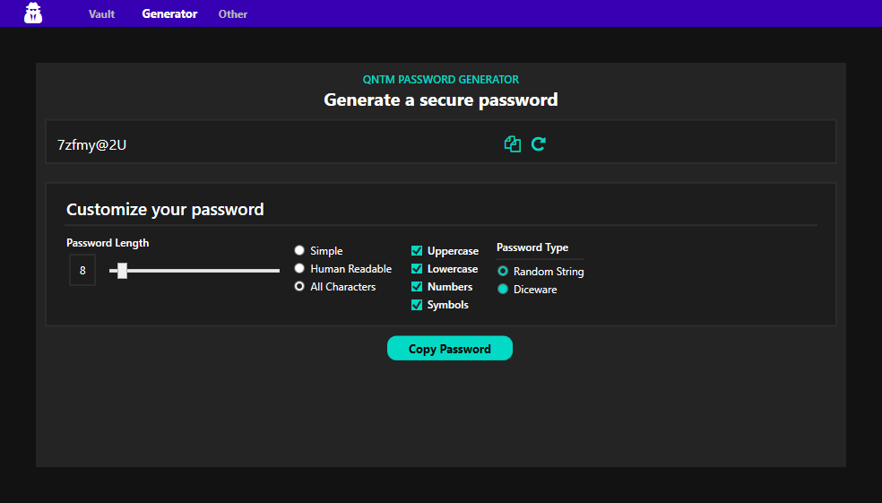

# QNTM State - Password Manager +  Encrypted Container

## Overview
* This is a .NET Framework 4.7.2 project
* WPF using the MVVM pattern
* Encrypt data using keys, passwords, or windows account
* Generate secure passwords with diceware or random string
* Code-First database design

## Screenshots

